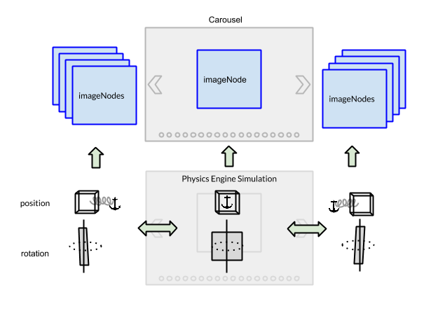

Famous' built-in physics engine allows us to add realistic motion to our application and animate our carousel.

Instead of using an external function to position our child elements as shown in the first steps of this lesson, we will use the Famous [physics engine](http://famous.org/learn/physics.html).

## About the physics engine

The physics engine simulates constraints and forces applied to bodies in space. In the simplest terms, we add bodies to the physics engine's simulation, set them in motion with forces, and then relay their positional data back to our visible components.

It's important to note that the physics engine is its own entity entirely and has no knowledge of our application. All of the <code>imageNodes</code> in our <code>Pager</code> will simply respond to the data provided by the physics engine's body simulations.

## Updating our simulation

When running a physics simulation, we need to use the core Famous component to manage frame-by-frame updates of our elements' positions. Expand the `Pager.js` file with the code below to do just that:

    // Not shown: Other `require` statements above here ^^^
    var PhysicsEngine = require('famous/physics/PhysicsEngine'); // To use later...
    var FamousEngine = require('famous/core/FamousEngine');

    function Pager(node, options) {
        // Not shown: The existing constructor statements

        // Add a physics simulation and update this instance
        // using regular time updates from the clock.
        this.simulation = new PhysicsEngine();

        // .requestUpdate will call the .onUpdate method next frame, passing in the time stamp for that frame
        FamousEngine.requestUpdate(this);
    }

    Pager.prototype.onUpdate = function(time) {
        this.simulation.update(time)
        // we will fill this out later
        // ...

        // by queueing up our .onUpdate, we can be sure this will be called every frame
        FamousEngine.requestUpdateOnNextTick(this);
    }

 By repeatedly calling on the `.requestUpdateOnNextTick()` method we can update our physics simulation and elements' positions up to 60 frames per second. Note how we use the `onUpdate` method to pass our simulation a time stamp `time`, call `.update()` on `this.simulation`, and then repeat.

## Adding physics bodies

Physics entities (such as bodies and forces) aren't themselves visible. Their data is used to control the position of elements that _are_ visible. The image below illustrates the relationship.

To animate an element's _x-position_, we will make use of a physics body called a `Box`, which we will attach to an _anchor point_ with a `Spring` force.

Moving the anchor point to the left and right will have the effect of pulling the `Box` along in space, thereby updating the `imageNode`'s x-position component in a dynamic manner.

Additionally, we will use a quaternion to control the y-rotation of the nodes, and attach these to `RotationalSpring` forces that will give each box an interesting animation when they move on and off screen.

    /**
     * Pager.js
     * [complete file not shown]
     */

    // We need to import all of these additional modules.
    var physics = require('famous/physics');
    var math = require('famous/math');
    var Box = physics.Box;
    var Spring = physics.Spring;
    var RotationalSpring = physics.RotationalSpring;
    var RotationalDrag = physics.RotationalDrag;
    var Quaternion = math.Quaternion;
    var Vec3 = math.Vec3;

Next, will add a `Box` body to each `imageNode` and link their movements through the `Pager` instance's `update` method.

    /**
     * Pager.js
     * [complete file not shown]
     */

    function _createPages(root, pageData) {
        var pages = [];

        for (var i = 0; i < pageData.length; i++) {
            var imageNode = root.addChild();

            imageNode.setSizeMode(1,1,1)
            imageNode.setAbsoluteSize(500, 500, 0);
            imageNode.setAlign(0.5, 0.5);
            imageNode.setMountPoint(0.5, 0.5);
            imageNode.setOrigin(0.5, 0.5);

            var el = new DOMElement(imageNode);
            el.setProperty('backgroundImage', 'url(' + pageData[i] + ')');
            el.setProperty('background-repeat', 'no-repeat');
            el.setProperty('background-size', 'cover');

            // A `Box` body to relay simulation data back to the visual element
            var box = new Box({
                mass: 100,
                size: [100,100,100]
            });

            // Place all anchors off the screen, except for the
            // anchor belonging to the first image node
            var anchor = i === 0 ? new Vec3(0, 0, 0) : new Vec3(1, 0, 0);

            // Attach the box to the anchor with a `Spring` force
            var spring = new Spring(null, box, {
                period: 0.6,
                dampingRatio: 0.5,
                anchor: anchor
            });

            // Rotate the image 90deg about the y-axis,
            // except for first image node
            var quaternion = i === 0 ? new Quaternion() : new Quaternion().fromEuler(0,-Math.PI/2,0);

            // Attach an anchor orientation to the `Box` body with a `RotationalSpring` torque
            var rotationalSpring = new RotationalSpring(null, box, {
                period: 1,
                dampingRatio: 0.2,
                anchor: quaternion
            });

            // Notify the physics engine to track the box and the springs
            this.simulation.add(box, spring, rotationalSpring);

            pages.push({
              node: imageNode,
              el: el,
              box: box,
              spring: spring,
              quaternion: quaternion,
              rotationalSpring: rotationalSpring,
              anchor: anchor
            });
        }

        return pages;
    }

Above, all nodes except the first one are positioned off of the screen and rotated out. But now the the `Pager` class will need an `update` method to link the `Box` bodies' transforms to the `imageNodes`.

    /**
     * Pager.js
     * [complete file not shown]
     */

     Pager.prototype.onUpdate = function(time) {
         this.simulation.update(time)

         var page;
         var physicsTransform;
         var p;
         var r;
         for (var i = 0, len = this.pages.length; i < len; i++) {
             page = this.pages[i];

             // Get the transform from the `Box` body
             physicsTransform = this.simulation.getTransform(page.box);
             p = physicsTransform.position;
             r = physicsTransform.rotation;

             // Set the `imageNode`'s x-position to the `Box` body's x-position
             page.node.setPosition(p[0] * this.pageWidth, 0, 0);

             // Set the `imageNode`'s rotation to match the `Box` body's rotation
             page.node.setRotation(r[0], r[1], r[2], r[3]);
         }

         Famous.requestUpdateOnNextTick(this);
     }

The code above loops through all of the image nodes, retrieves a transform from each `Box` body in the physics simulation, and then applies the transformation to the corresponding node's position and rotation components. Note how we use `this.pageWidth` to offset our boxes in relation to the width of the screen.

Now our `imageNodes` are linked to boxes in the physics simulation. However, we will need to apply forces to the boxes in order to animate the carousel. In the next section, we will use events to provide these forces.

<strong>Modified files:</strong> <a href="https://github.com/famous/lesson-carousel-starter-kit/blob/step7-AddPhysics/src/carousel/Pager.js">Pager.js</a> | <a href="https://github.com/Famous/lesson-carousel-starter-kit/blob/step7-AddPhysics/src/carousel/Carousel.js">Carousel.js</a>

<strong>Section recap:</strong> <a href="https://github.com/famous/lesson-carousel-starter-kit/tree/step7-AddPhysics">Code for this step</a>

[Up next: User interaction &raquo;](./UserInteraction.html)

