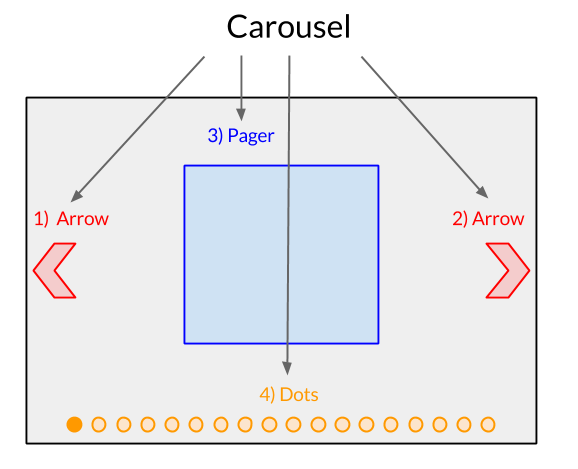

Let's look at the architecture of our carousel application from a high level before we get too deep into the code. Planning out the main components "on paper" first can save us a lot of development time later.

Think of the `Carousel` class as the main entrypoint of our app. Its job is primarily to attach our app to the DOM, and provide a central harness to which to add other elements.

We'll organize our app into a set of classes representing each of the children of the `Carousel`. Breaking the app up in this way helps separate concerns and keep code modular.

## Child elements

At the top level, our `Carousel` instance will have three main child classes: `Arrow`, `Dots`, and `Pager`. Instances of these classes will represent the four areas shown in the diagram below.

For all of the visual components shown above, we will need a new scene graph node descending from the `Carousel` instance's root node. Adding [components](#) to those nodes will give us the ability to size and position them into the exact layout we want.

[Up next: Layout &raquo;](./Layout.html)

