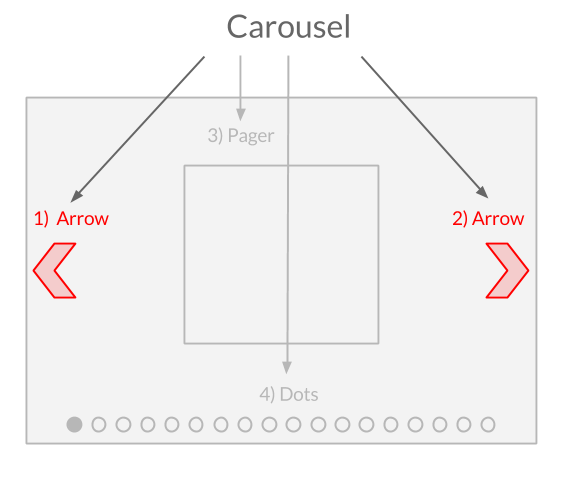

To handle rendering of the _next/previous_ navigation arrows for the carousel, we'll create an `Arrow` class. (This is one of the three modules that will be required by our `Carousel.js` file.)

All of our child element classes (<code>Arrows</code>, <code>Dots</code>, <code>Pager</code>) will take a <code>node</code> and <code>options</code> object as constructor parameters.

Save the code below into the file `Arrow.js`, and then uncomment all references to `Arrow` in `Carousel.js`, including the `require()` statement at top and calls to this.arrow in `_positionComponents`. 

    /**
     * Arrow.js
     */

    var DOMElement = require('famous/dom-renderables/DOMElement');

    function Arrow(node, options) {
      this.node = node;
      this.el = new DOMElement(node);
      this.el.setProperty('color', 'white')
      this.direction = options.direction;
      this.el.setContent(this.direction === 1 ? '>' : '<');
      this.el.setProperty('fontSize', '40px');
      this.el.setProperty('lineHeight', '40px');
      this.el.setProperty('cursor', 'pointer');
      this.el.setProperty('textHighlight', 'none');
      this.el.setProperty('zIndex', '2');
    }

    module.exports = Arrow;

Note how the `node` passed into the `Arrow` constructor will be the same scene graph child node that we added in the `Carousel` constructor. Nodes can be freely passed around like this at our convenience. However, as we mentioned before, we recommend managing layout (size, position) from the parent.

## Seeing your progess

If you're following along using the carousel starter kit, uncomment the call to `_positionComponents` in Carousel and save your files. Next, run the same deploy command in the terminal from your root directory:

    $ famous deploy

Running this command will update your deployed project and return the same sharable link and embed code. Every time you run the deploy command your project will update almost instantly on the Famous cloud. 

By using git and the Famous CLI, you can easily switch branches, revert unwanted changes, and then run the simple deploy command to update your project on the go. 

<strong>Modified files:</strong> <a href="https://github.com/famous/lesson-carousel-starter-kit/blob/step4-AddArrowClass/src/carousel/Arrow.js">Arrow.js</a> | <a href="https://github.com/famous/lesson-carousel-starter-kit/blob/step4-AddArrowClass/src/carousel/Carousel.js">Carousel.js</a>

<strong>Section recap:</strong> <a href="https://github.com/famous/lesson-carousel-starter-kit/tree/step4-AddArrowClass">Code for this step</a>

[Up next: Dots &raquo;](./Dots.html)

