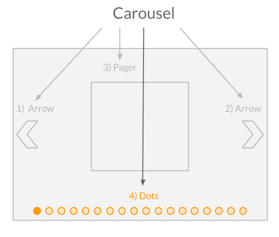

Now let's introduce another element to the application --- the `Dots` module --- which is used to indicate the total number of slides, and give context by highlighting the dot that represents the currently active slide.

If you haven't yet, create the file `Dots.js`, and add the code below to it. Read through all of the inline comments to understand how the dots area is constructed.

    var DOMElement = require('famous/dom-renderables/DOMElement');

    function Dots(node, options) {
        this.node = node;
       // Storage for all the children -- the 'dot' nodes
        this.dots = [];

        // Size and positioning for the individual dots
        this.dotWidth = options.dotWidth || 10;
        this.spacing = options.spacing || 5;

        // Determine how many children to add, and add them
        this.numPages = options.numPages;
        for (var i = 0; i < this.numPages; i++) {
            // Create new child node for each dot
            var dotNode = node.addChild();

            // Size the child
            dotNode.setSizeMode(1,1)
            dotNode.setAbsoluteSize(this.dotWidth, this.dotWidth)

            // Store child nodes in the dots array
            this.dots.push(new Dot(dotNode, i));
        }

        // Highlight the first dot in the collection
        this.dots[0].select();
    }

    // Evenly space out the dots
    Dots.prototype.layoutDots = function(size) {
        if (size) {
            this.size = size;
        }
        var totalDotSize = this.dotWidth * this.numPages + this.spacing * (this.numPages - 1);
        var start = (this.size[0] - totalDotSize) / 2;
        for (var i = 0; i < this.numPages; i++) {
            this.dots[i].node.setPosition(start + (this.dotWidth + this.spacing) * i, 0, 0);
        }
    }

    // Updating the selected dots on change of current page.
    Dots.prototype.pageChange = function(oldIndex, newIndex) {
        this.dots[oldIndex].deselect();
        this.dots[newIndex].select();
    }

    module.exports = Dots;

## Dot class

We'll also introduce a class `Dot` that will encapsulate an individual dot among the dots collection. You can think of a `Dot` as a _grandchild_ of `Carousel`, carrying the visible element for each dot.

    /**
     * Dots.js
     * [complete file not shown]
     */

    function Dot(node, options) {
        this.node = node;
        this.el = new DOMElement(node);
        this.el.setProperty('borderRadius', '5px');
        this.el.setProperty('border', '2px solid white');
        this.el.setProperty('boxSizing', 'border-box');
    }

    Dot.prototype.select = function() {
        this.el.setProperty('backgroundColor', 'white');
    };

    Dot.prototype.deselect = function() {
        this.el.setProperty('backgroundColor', 'transparent');
    };

<strong>Modified files:</strong> <a href="https://github.com/famous/lesson-carousel-starter-kit/blob/step5-AddDotsClass/src/carousel/Dots.js">Dots.js</a> | <a href="https://github.com/famous/lesson-carousel-starter-kit/blob/step5-AddDotsClass/src/carousel/Carousel.js">Carousel.js</a>

## Positioning the Dots

We will need to pass the scene size to the `.layoutDots()` method to get the dots evenly distributed across the screen. Instead of pinging the DOM for the width, we'll grab the size by registering an `onSizeChange` method within a resize component.

Add the code below to the `Dots` constructor.

    // Add a component to keep dot layout updated
    var resizeComponent = {
        onSizeChange: function(x, y, z) {
            // This will layout the dots whenever a resize occurs
            this.layoutDots([x, y, z])
            // Size === [parent size, 20, parent size]
        }.bind(this)
    };
    this.node.addComponent(resizeComponent);

<strong>Modified files:</strong> <a href="https://github.com/famous/lesson-carousel-starter-kit/blob/step5-AddDotsClass/src/carousel/Carousel.js">Carousel.js</a>

Now, whenever the node is resized, the method above will fire with the new size passed in. You can register an `onSizeChange` method with any component to get the current `x,y,z` size of a node. If a node doesn't have a size in a particular direction it will return the size of its parent.

## Seeing Dots

To get your dots on the screen, open up `Carousel.js`, uncomment out all references to the `Dots` class in that file, and then from the terminal run:

    $ famous deploy

Visit the sharable link to see your dots live on the web.

<strong>Section recap:</strong> <a href="https://github.com/famous/lesson-carousel-starter-kit/tree/step5-AddDotsClass">Code for this step</a>

[Up next: Pager &raquo;](./Pager.html)

