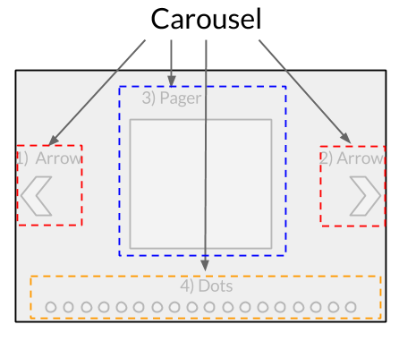

Let's look at how to organize and position elements in Famous in order to create a layout for our application.

We'll use the parent class, `Carousel`, to initialize the sub-elements of the app. You can follow along in the [Carousel.js](https://github.com/famous/lesson-carousel-starter-kit/blob/step1-HelloFamous/src/carousel/Carousel.js) file.

The diagram above illustrates where within the screen each of the elements will reside. We can establish these element areas by adding [scene graph nodes](http://famous.org/learn/scene-graph.html) to the root node, and then extending them with [components](http://famous.org/learn/components.html).

## Adding child elements

Since all elements in Famous are represented by [scene graph nodes](http://famous.org/learn/scene-graph.html), we need to add new nodes in order to establish new elements. To add a child node, simply call `.addChild()` on the scene graph node you wish to extend. (The returned object will be a new node that you can add even more children to, and so on.)

Because we need to create four elements --- two `Arrow` elements, a `Dots` element, and a `Pager` element, we will need to call `.addChild()` four times on our root node `this.root`. Below, note how we pass our child nodes ( `this.root.addChild()` ) to constructors for each section.

    /**
     * Carousel.js (as of step 1)
     */

    var FamousEngine = require('famous/core/FamousEngine');
    var DOMElement = require('famous/dom-renderables/DOMElement');
    //we will build these files in the `Organizing Code` step
    // var Arrow = require('./Arrow.js');
    // var Pager = require('./Pager.js');
    // var Dots = require('./Dots.js');

    function Carousel(selector, data) {
        this.context = FamousEngine.createScene(selector);
        this.root = this.context.addChild();

        // Keep reference to the page data, which is
        // the images we'll display in our carousel
        this.pageData = data.pageData;

        this.arrows = {
            back: new Arrow(this.root.addChild(), { direction: -1 }),
            next: new Arrow(this.root.addChild(), { direction: 1 })
        };

        this.pager = new Pager(this.root.addChild(), { pageData: this.pageData });

        this.dots = new Dots(this.root.addChild(), { numPages: this.pageData.length });
        
        //we will build this function in the next step
        _positionComponents.call(this)

    }

    module.exports = Carousel;

## Positioning children

Now that all of the child elements are initialized, we can position them.

We'll put the positioning code into an external function called `_positionComponents()`. Also note the `_` (underscore) prefix, which we recommend to denote functions that are private to a module.

Copy and paste the following code snippet just below your `Carousel` constructor.

    /**
     * Carousel.js (as of step 2)
     * [complete file not shown]
     */

    // Place this snippet directly below the `Carousel`
    // constructor function.

    function _positionComponents() {

        this.arrows.back.node.setSizeMode('absolute','absolute')
        this.arrows.back.node.setAbsoluteSize(40, 40);
        this.arrows.back.node.setPosition(40, 0, 0);
        this.arrows.back.node.setAlign(0, .5, 0);
        this.arrows.back.node.setMountPoint(0, .5, 0);

        this.arrows.next.node.setSizeMode('absolute','absolute')
        this.arrows.next.node.setAbsoluteSize(40, 40);
        this.arrows.next.node.setPosition(-40, 0, 0);
        this.arrows.next.node.setAlign(1, .5, 0);
        this.arrows.next.node.setMountPoint(1, .5, 0);

        this.dots.node.setSizeMode('default','absolute')
        this.dots.node.setAbsoluteSize(null, 20);
        this.dots.node.setPosition(0, -50, 0);
        this.dots.node.setAlign(.5, 1, 0);
        this.dots.node.setMountPoint(.5, 1, 0);

        this.pager.node.setAlign(.5, .5, 0);
        this.pager.node.setMountPoint(.5, .5, 0);
    }

With this function, our nodes will be [sized] and positioned. However, before any content will be visible, we will need to flesh out the classes for the child elements `Pager`, `Arrow`, and `Dots`.

Before moving on to the next step, lets comment out all of the child intances and the `_positionComponents` call in Carousel, so we can view our project as it gets built. Check out the modified file below if you get lost at this step. If you forget to do this, you will get the error: `Arrow not defined`.

<strong>Modified files:</strong> <a href="https://github.com/famous/lesson-carousel-starter-kit/blob/step3-PositioningChildren/src/carousel/Carousel.js">Carousel.js</a>

<strong>Section recap:</strong> <a href="https://github.com/famous/lesson-carousel-starter-kit/tree/step3-PositioningChildren">Code for this step</a>

[Up next: Organizing code &raquo;](./OrganizingCode.html)

