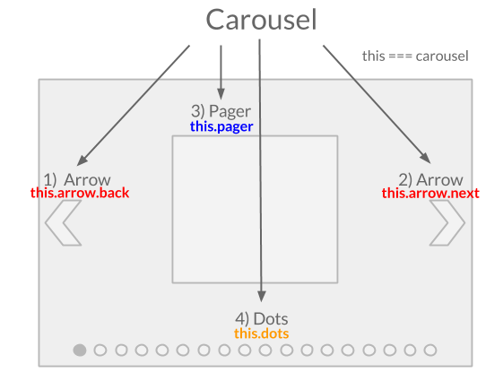

To keep our code organized and tidy, we'll put each of the subcomponents --- `Dots`, `Arrow`, `Pager` -- into individual classes, each of which will live within their own file.

In your project, create files for `Arrow`, `Pager`, and `Dots`, such that the `src/carousel` directory looks like this:

    - Carousel.js
    - Arrow.js
    - Pager.js
    - Dots.Js

Then, take a close look at the following diagram, which illustrates how each of the subcomponents are associated with the child nodes we created within the `Carousel` constructor.

As we add our class files, make sure you also uncomment/import them at the top of <code>Carousel.js</code>. It's a good idea to always double-check the top of your modified files to ensure that all dependencies are loaded with <code>require()</code> before calling them.

[Up next: Arrows &raquo;](./Arrows.html)

