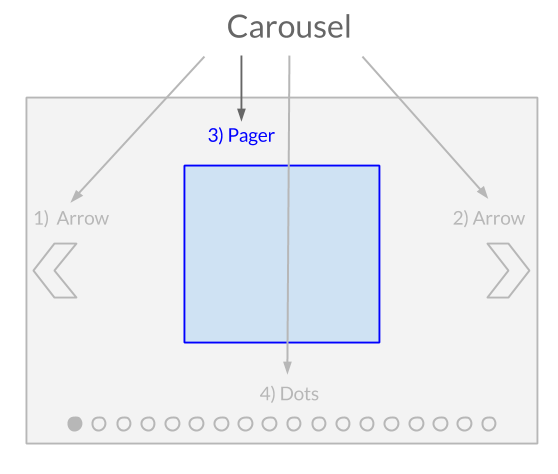

The `Pager` is the element that holds the display images. Architecturally, it will also hold most of the carousel's browsing logic.

The images on display will be represented by a collection of `imageNodes`. To give our app a realistic feel, we will animate the `imageNode` elements using Famous' built-in physics engine.

Let's set up our `Pager` class and the `imageNodes` before adding the physics-based animation. Paste the code below into the file `Pager.js`, and then uncomment all references to `Pager` included in `Carousel.js`.

    /**
     * Pager.js
     */
     var DOMElement = require('famous/dom-renderables/DOMElement');
     var PhysicsEngine = require('famous/physics/PhysicsEngine'); // To use later...

     function Pager (node, options) {
         this.node = node;
         this.currentIndex = 0;
         this.threshold = 4000;
         this.pageWidth = 0;

         this.pages = _createPages.call(this, node, options.pageData);
     }

     Pager.prototype.defineWidth = function(size){
       this.pageWidth = size[0];
     }

     function _createPages(root, pageData) {
         var pages = [];

         for (var i = 0; i < pageData.length; i++) {
             var imageNode = root.addChild();

             imageNode.setSizeMode(1,1,1)
             imageNode.setAbsoluteSize(500, 500, 0);
             imageNode.setAlign(0.5, 0.5);
             imageNode.setMountPoint(0.5, 0.5);
             imageNode.setOrigin(0.5, 0.5);

             var el = new DOMElement(imageNode);
             el.setProperty('backgroundImage', 'url(' + pageData[i] + ')');
             el.setProperty('background-repeat', 'no-repeat');
             el.setProperty('background-size', 'cover');

             pages.push(imageNode);
         }

         return pages;
     }

     module.exports = Pager;

Notice how we use the external private function `_createPages` to construct and return an array of `imageNodes` instead of using a new class for each node. This shows that classes aren't a necessity for Famous; using them is up to our discretion as developers.

## Finding the width

Similar to our `Dots`, let's get the width using an `onSizeChange` method on a resize component for the `Pager`. This value will come into play later when we want to position our `imageNodes` off the screen.

    var resizeComponent = {
        onSizeChange: function(size) {
            this.defineWidth(size)
        }.bind(this)
    };
    this.node.addComponent(resizeComponent);

Add the lines above inside the `Pager` constructor. Refer back to the previous [Dots](./Dots.html) steps if you need a refresher on the `onSizeChange` method.

## Seeing it live

    $ famous deploy

If you save the `Pager.js` file and run the command above, you'll find that all of your images will be stacked on top of each other when visiting the sharable link 

<strong>Modified files:</strong> <a href="https://github.com/famous/lesson-carousel-starter-kit/blob/step6-AddPager/src/carousel/Pager.js">Pager.js</a> | <a href="https://github.com/famous/lesson-carousel-starter-kit/blob/step6-AddPager/src/carousel/Carousel.js">Carousel.js</a>

<strong>Section recap:</strong> <a href="https://github.com/famous/lesson-carousel-starter-kit/tree/step6-AddPager">Code for this step</a>

[Up next: Animating with physics &raquo;](./AnimatingWithPhysics.html)

