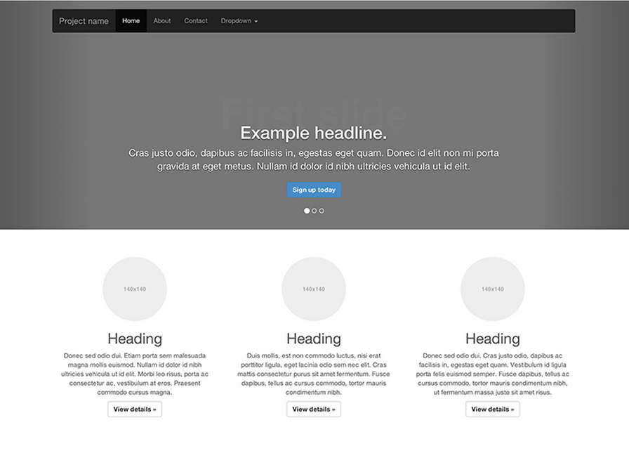

We will embed our Famous container by pasting the code from the previous section into a new web page. Let's work with a classic Bootstrap carousel template to demonstrate how easy it is to embed our Famous project. 

## Downloading the Bootstrap page

Head to the Bootstrap Carousel example page at: [http://getbootstrap.com/examples/carousel/](http://getbootstrap.com/examples/carousel/) and hit _ctrl/command + S_  to save the page on your computer. Save the complete webpage so you store the assets with it. 

<b>Note:</b> Alternatively, you can also get the Bootstrap Carousel page by cloning down the Bootstrap project at: <a href="https://github.com/twbs/bootstrap">https://github.com/twbs/bootstrap</a> and navigating to <code>index.html</code> file located in the <code>docs > examples > carousel</code> directory.

## Replacing the carousel

Open the HTML file up in your favorite text editor. Delete the Bootstrap carousel by removing the `
` with the `myCarousel` class and everything in between. This should include everything between the `<!-- Carousel --> <!-- /.carousel -->` comments. 

Using the embeddable HTML code you copied in the previous section, paste the lines into the area where the Bootstrap carousel was previously located.

<!-- Note that you can also replace any element on the page with the carousel. In the final example, we also replace all of the _featurette images_ with the same carousel. -->

## Styling the container

In order for your newly embedded container to show up on your page, you need to give it a height and width. Do this by styling the `div` with CSS either inline or externally via a class or ID. While we recommend always styling elements externally through classes or IDs, for this example, we'll use inline styles to keep things brief. 

Within the `
` tag you just pasted, give it a style attribute with a height of 500px, a width of 100% and a bottom margin of 15px so it looks like the snippet below. 

     

Now if you save and open up your HTML page in the browser, the Famous Carousel widget should be included in place of the old one. 

## Multiple containers

Containers can be used in multiple areas of the page without conflicting with each other or the page where they are embedded. You can follow the same steps above to add several containers to a page. 

[Upgraded carousel example](http://learn-staging.famo.us/lessons/container/assets/example/Carousel%20Template%20for%20Bootstrap.html)

 In our upgraded carousel example above, we replaced all of the _featurette images_ with the same `Embedded Carousel` container. Note that multiple containers can share a single  `<script>` tag when embedded on the same page.

[Up Next: Finish &raquo;](./Finish.html)