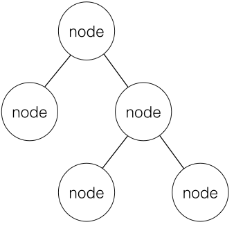
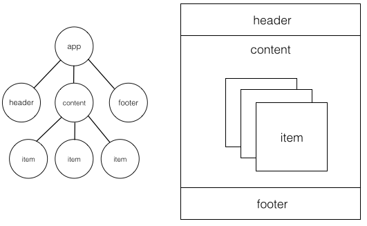

When building an application in Famous, much of your work will deal with managing and manipulating a data structure called the _scene graph_. Understanding the scene graph is essential to understanding Famous as a whole.

_Note: These concepts become more concrete in the [displaying content](displaying-content.html) guide._

## What is a scene graph?

Think of the scene graph as a family tree of display elements. Each element in the tree is a _node_. Each node can have zero or more children and at most one parent. You can think of all the descendents of a node as being grouped together.

The scene graph represents the _structure_ of your application. Whereas in HTML, sub-elements are represented with tag nesting, in Famous, sub-elements are represented as child nodes. Here's a visualization of how a scene graph structure might relate to an application's UI:

In this illustration, we see a simple application compared to its scene-graph representation. The top-level of the application is the root node. It has three children: header, content area, footer. Meanwhile, the content area itself has three children: the items.

## Creating a scene graph

In your Famous code, we create a scene graph by spawning nodes from your application's main _scene_, and then adding children to them. To create the above scene graph in Famous code, we could write the following:
    
    var FamousEngine = require('famous/core/FamousEngine');

    // Initialize the FamousEngine to start the rendering process
    FamousEngine.init();

    // Create a scene for the FamousEngine to render
    var scene = FamousEngine.createScene();
    var appNode = scene.addChild();
    var headerNode = appNode.addChild();
    var contentNode = appNode.addChild();
    var footerNode = appNode.addChild();
    var itemNode1 = contentNode.addChild();
    var itemNode2 = contentNode.addChild();
    var itemNode3 = contentNode.addChild();

## Rendering the scene graph

We've learned that a scene graph gives us our application's structure --- but how do we display it? The scene graph by itself isn't enough. As we'll see in the next section, to actually display content, we'll need to _decorate_ our nodes with [components](components.html).
